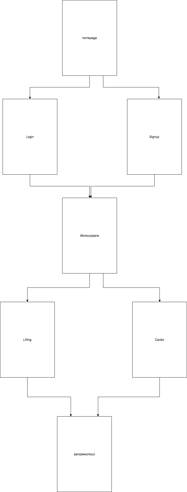

# Elite Training

## Overview


Health is a important topic now a days and with the growing popularity in working out and lifting there is an increase in demand for people wanting to learn how to train. This is were Elite Training comes in. Recently I was looking into a weight training app to give me some simple workout plans and I could not find a descent one that was not shoving a monthly subscription in my face. 

Elite Training is a place where you will find a community of people similar to yourself sharing the best workout and lifting plans out there. In addition, unlike those other apps that require expensive monthly subscriptions, we are 100% free and transparent.  


## Data Model


The application will store Users and Workout plans

* users can have multiple workout plans 
* each list can have multiple workout plans

(___TODO__: sample documents_)

An Example User:

```javascript
{
  username: "shannonshopper",
  hash: // a password hash,
  lists: // an array of references to List documents
}
```

An Example List with Embedded Items:

```javascript
{
  user: // a reference to a User object
  name: "Breakfast foods",
  items: [
    { name: "pancakes", quantity: "9876", checked: false},
    { name: "ramen", quantity: "2", checked: true},
  ],
  createdAt: // timestamp
}
```


## [Link to Commented First Draft Schema](db.js) 

(___TODO__: create a first draft of your Schemas in db.js and link to it_)

## Wireframes


/homepage - page for login or signup.


/signup - page for signup.


/login - page for login.


/workoutplans - page for selecting the type of workout plans.


/lifting - page for choosing what body area to target.


/cardio - page for choosing were they want to do the cardio.


/sampleworkout - sample page of user created workout.


## Site map




## User Stories or Use Cases

(___TODO__: write out how your application will be used through [user stories](http://en.wikipedia.org/wiki/User_story#Format) and / or [use cases](https://www.mongodb.com/download-center?jmp=docs&_ga=1.47552679.1838903181.1489282706#previous)_)

1. as non-registered user, I can register a new account with the site
2. as a user, I can log in to the site
3. as a user, I can choose between either cardio or lifting
4. as a user, I can choose where I am doing the cardio
5. as a user, I can view other peoples posted workouts
6. as a user, I can choose the body area the lifting is targeting

## Research Topics

(___TODO__: the research topics that you're planning on working on along with their point values... and the total points of research topics listed_)

* (4 points) I am going to use client-side JavaScript library React
    * I'm going to be using React for the client-side. It is not the most challenging library, but it also isn't easy.
* (2 points) Use CSS framework. TBD which one.
    * I will be using one of the given CSS frameworks. I have yet to decide which one.
* (2 points) Incorperate weather API on the cardio page
    * I will be adding a weather API to the cardio page so users can decide what is the best choice

10 points total out of 8 required points (___TODO__: addtional points will __not__ count for extra credit_)


## [Link to Initial Main Project File](app.js) 

## Annotations / References Used

